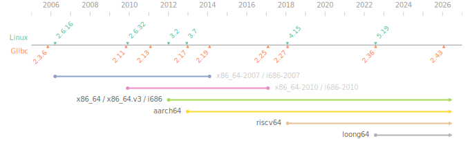

# Portable Linux GCC

Native GNU/Linux GCC toolchain that depends on old glibc, and targets (relatively) new, static glibc that runs on old kernel.



## Build

1. Prepare build environment:
   ```bash
   podman build -t portable-linux-gcc/buildenv support/buildenv
   ```
2. Launch build environment:
   ```bash
   podman run -it --rm \
     --cap-add=sys_admin \
     -v $PWD:/mnt -w /mnt \
     portable-linux-gcc/buildenv
   ```
   To expose build directories for debugging:
   ```bash
   podman run -it --rm \
     --cap-add=sys_admin \
     -v $PWD:/mnt -w /mnt \
     -v $PWD/build:/tmp/build \
     -v $PWD/layer:/tmp/layer \
     portable-linux-gcc/buildenv
   ```
3. In the build environment, run:
   ```bash
   ./main.py -a <arch>
   ```

Available architectures:

| Arch | Host glibc | Target glibc | Min. kernel | Typ. distro. |
| ---- | ---------- | ------------ | ----------- | ------------ |
| x86_64    | 2.13 | 2.43 | 3.2  | Debian 7, Ubuntu 12.04, EL 7 |
| x86_64.v3 | 2.13 | 2.43 | 3.2  | Debian 7, Ubuntu 12.04, EL 7 |
| aarch64   | 2.17 | 2.43 | 3.7  | — (baseline)* |
| riscv64   | 2.27 | 2.43 | 4.15 | — (baseline)* |
| loong64   | 2.36 | 2.43 | 5.19 | — (baseline)* |

\* aarch64, riscv64, loong64: The toolchains target their baselines (the first versions of Linux and glibc that support the architecture).

Legacy architectures:

| Arch | Host glibc | Target glibc | Min. kernel | Typ. distro. |
| ---- | ---------- | ------------ | ----------- | ------------ |
| x86_64-2010 | 2.11  | 2.25 | 2.6.32 | Debian 6, Ubuntu 10.04, EL 6 |
| x86_64-2007 | 2.3.6 | 2.19 | 2.6.16 | Debian 4, Ubuntu 6.10, EL 5 |
| i686        | 2.13  | 2.43 | 3.2    | Debian 7, Ubuntu 12.04, EL 7 |
| i686-2010   | 2.11  | 2.25 | 2.6.32 | Debian 6, Ubuntu 10.04, EL 6 |
| i686-2007   | 2.3.6 | 2.19 | 2.6.16 | Debian 4, Ubuntu 6.10, EL 5 |
